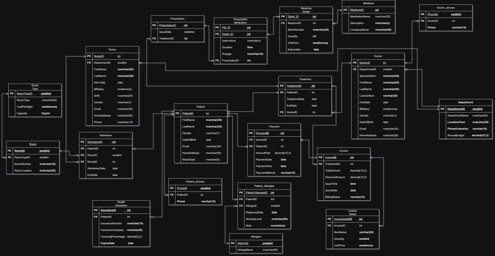
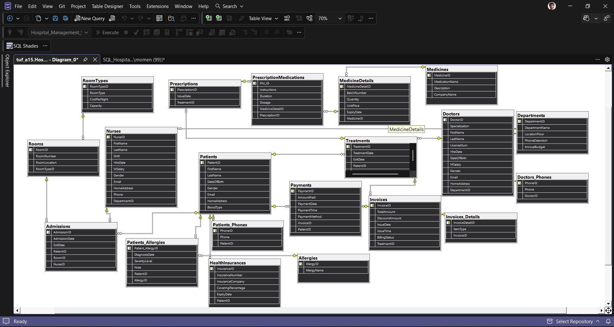

# Hospital Management System — Database

A relational database built with **SQL Server** to manage the core operations of a hospital, including patients, doctors, treatments, prescriptions, admissions, and billing.

---

## Overview

This project models a real hospital workflow from the moment a patient walks in — through treatment and medication — all the way to checkout and payment. The database is designed with data integrity, clear relationships, and practical scalability in mind.

---

## Database Structure

The schema contains **20 tables** organized into 5 functional areas:

### 👤 People & Staff
| Table | Description |
|---|---|
| `Patients` | Core patient info (name, DOB, gender, blood type, address) |
| `Patients_Phones` | Multi-value phone numbers per patient |
| `Doctors` | Doctor profiles with specialization, license, salary, and department |
| `Doctors_Phones` | Multi-value phone numbers per doctor |
| `Nurses` | Nurse profiles with shift info and department assignment |

### 🏥 Hospital Structure
| Table | Description |
|---|---|
| `Departments` | Hospital departments with floor location, budget, and extension |
| `Rooms` | Physical rooms with location info |
| `RoomTypes` | Room categories with cost per night and capacity |

### 🩺 Medical Records
| Table | Description |
|---|---|
| `Treatments` | Links a patient to a doctor for a specific treatment period |
| `Prescriptions` | Prescription issued during a treatment |
| `PrescriptionMedications` | Medicines included in a prescription with dosage and duration |
| `Allergies` | Allergy catalog |
| `Patients_Allergies` | Patient-specific allergy records with severity and diagnosis date |
| `HealthInsurances` | Insurance details linked to each patient |

### 💊 Medications & Inventory
| Table | Description |
|---|---|
| `Medicines` | Medicine catalog with name and manufacturer |
| `MedicineDetails` | Batch-level inventory: quantity, price, and expiry date |

### 💰 Admissions & Billing
| Table | Description |
|---|---|
| `Admissions` | Patient room admissions managed by a nurse |
| `Invoices` | Invoice per treatment with total, discount, and status |
| `Invoices_Details` | Line items inside each invoice |
| `Payments` | Payment records with method and timestamp |

---

## Key Design Decisions

- **Multi-value attributes** like phone numbers are separated into their own tables (`Patients_Phones`, `Doctors_Phones`) to follow normalization principles.
- **Medicine inventory** is tracked at the batch level (`MedicineDetails`) — different batches of the same medicine can have different prices and expiry dates.
- **Billing** is built in two layers: a summary invoice (`Invoices`) and itemized line entries (`Invoices_Details`), making it easy to audit any charge.
- **Payments** are stored separately from invoices to support partial payments and multiple payment methods.
- **Timestamps** on invoices and payments capture both date and time using `DATE` + `TIME` columns.

---

## Constraints & Data Integrity

- `CHECK` constraints enforce non-negative values for prices, quantities, salaries, and budgets.
- `NOT NULL` constraints protect required fields like names, license numbers, and hire dates.
- `DEFAULT` values auto-fill dates (`GETDATE()`) and set sensible starting values for quantities and prices.
- `IDENTITY` columns handle all primary key generation automatically.
- `FOREIGN KEY` relationships enforce referential integrity across all linked tables.

> **Note:** Some columns have domain-specific constraints including:
> - `Gender` → `CHECK (Gender IN ('M', 'F'))`
> - `RoomType` → `CHECK (RoomType IN ('ICU Room', 'Private Room', 'General Ward', ...))`
> - `BillingStatus` → `CHECK (BillingStatus IN ('Paid', 'UnPaid', 'Partially Paid', 'Rejected'))`
> - `PaymentMethod` → `CHECK (PaymentMethod IN ('Cash', 'Card', 'Online'))`
> - `SeverityLevel` → `CHECK (SeverityLevel IN ('Mild', 'Moderate', 'Severe'))`

---

## Entity Relationship Diagram






---

> ## ⚠️ Note on Sample Data
> Some data in this project was generated using AI tools and online data generators.
> It may contain unrealistic values or minor inconsistencies — it's used for testing purposes only.


---

## How to Run

1. Open **SQL Server Management Studio (SSMS)**
2. Run the full script — it will create the database if it doesn't exist yet
3. All tables will be created in the correct dependency order

```sql
-- NOTE: Run this script first to initialize the database
IF NOT EXISTS (SELECT * FROM sys.databases WHERE NAME = 'Hospital_Management_SystemDB')
    CREATE DATABASE Hospital_Management_SystemDB;
```


## Tech Stack

- **Database:** Microsoft SQL Server
- **Tool:** SQL Server Management Studio (SSMS)

---

## Project Status

- [x] Schema design and table creation  
- [x] Constraints and relationships  
- [x] Domain CHECK constraints (gender, status fields)  
- [x] Sample data insertion  
- [ ] Views and stored procedures  

---

## Author

**Momen**  
Computer Science Student  
